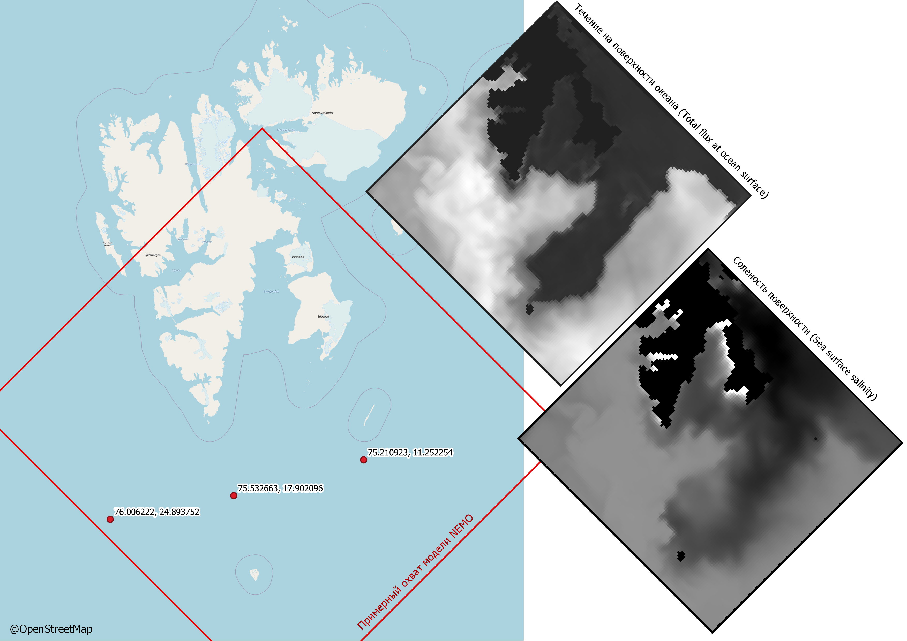

## Расположение тестовых точек:

OSM лежит на метрическом псевдомеркаторе (Pseudo-Mercator - EPSG:3857), вывод из NEMO - WGS 84 (EPSG:4326), привязка по центру каждой ячейки, изображения повернуты на 45° и масштабированы для сходства - реальное положение отражают только примерно.

Интересно отметить, что для большей части моделируемых параметров характерна такая условная граница разделения акватории, как на изображениях. Что обуславливает большую стабильность тестовой точки, расположенной за пределами зоны воздействия течения. Этот факт подтверждается наличием ярко выраженной 14-дневной цикличности ([расчеты](./ARIMA%2BNEMO_as_exog.ipynb)) для двух "правых" точек - (75.210923, 11.252254) и (75.532663, 17.902096) и отсутствием такой цикличности для "левой" точки - (76.006222_24.893752).